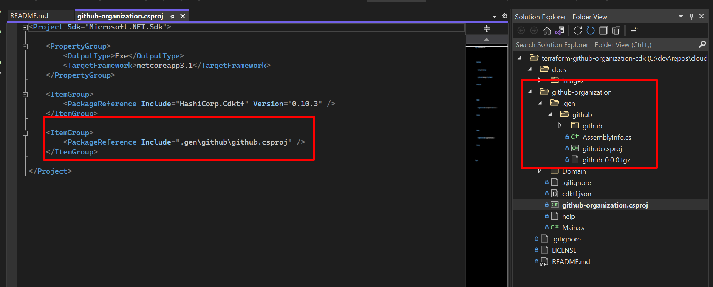
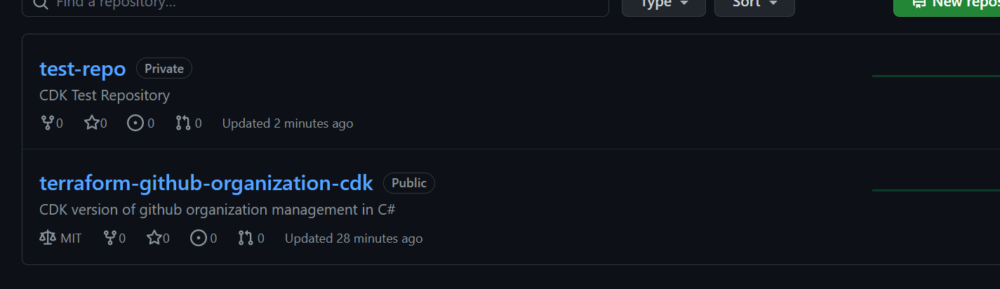

- [terraform-github-organization-cdk](#terraform-github-organization-cdk)
  - [Getting Started](#getting-started)
  - [Github Provider](#github-provider)
  - [Create a Repository](#create-a-repository)
    - [Deploy](#deploy)
    - [Destroy](#destroy)
  - [Resources](#resources)

# terraform-github-organization-cdk

CDK version of github organization management in C#

## Getting Started

Need NodeJS

Install terraform
`choco install terraform`
`brew install terraform`

Install cdktf-cli
`npm install -g cdktf-cli`

Depending on the provider you are working with. You might need the CLI for that provider installed.

Login to TF Cloud
`cdktf login`

Initialize a project
`cdktf init --template=csharp`

Add provider version

```json
{
  "language": "csharp",
  "app": "dotnet run -p github-organization.csproj",
  "projectId": "9a17bdee-303b-4a00-81e5-71a28652ad58",
  "terraformProviders": ["github@~>4.24.1"],
  "terraformModules": [],
  "context": {
    "excludeStackIdFromLogicalIds": "true",
    "allowSepCharsInLogicalIds": "true"
  }
}
```

Once updated, run `cdktf get` to pull in provider libraries.

After the provider files have been downloaded, add a reference in your csproj file.



## Github Provider

Set environment variable `GITHUB_TOKEN` in your terminal.

`Main.cs`

```csharp
using System;
using Constructs;
using HashiCorp.Cdktf;
using github;


namespace MyCompany.MyApp
{
    class MyApp : TerraformStack
    {
        public MyApp(Construct scope, string id, string[] args) : base(scope, id)
        {
            // define resources here
            new GithubProvider(this, "github", new GithubProviderConfig
            {
                Organization = "cloud-tinkerers"
            })
        }
  ...
}
```

## Create a Repository

`Resources/RepositoryResources.cs`
```csharp

namespace GitHubOrganization.Resources;

public class RepositoryResources
{
    public RepositoryResources(Construct scope, string id)
    {
         new Repository(scope, id, new RepositoryConfig
         {
             
                Name = "test-repo",
                Description = "CDK Test Repository",
                Visibility = "private",

                HasIssues = true,
                HasDownloads = true,
                HasProjects = true,

                AllowMergeCommit = true,
                AllowAutoMerge = true,
                AutoInit = true,
                GitignoreTemplate = "Terraform"
         });
    }
}
```

`Main.cs`
```csharp
using GitHubOrganization.Resources;

namespace GitHubOrganization
{
    class MyApp : TerraformStack
    {
        public MyApp(Construct scope, string id) : base(scope, id)
        {
            // define resources here
            new GithubProvider(this, "github", new GithubProviderConfig
            {
                Organization = "cloud-tinkerers"
            });

            new RepositoryResources(this, "repo");
        }
  ...
}
```

### Deploy

Run `cdktf deploy` to deploy the code.

```hcl
❯ cdktf deploy
Warning NETSDK1174: The abbreviation of -p for --project is deprecated. Please use --project.


App synth complete

github-organization  Initializing the backend...
github-organization  Initializing provider plugins...
                     - Reusing previous version of hashicorp/github from the dependency lock file
github-organization  - Using previously-installed hashicorp/github v4.24.1
github-organization  ╷
                     │ Warning: Additional provider information from registry
                     │
                     │ The remote registry returned warnings for
                     │ registry.terraform.io/hashicorp/github:
                     │ - For users on Terraform 0.13 or greater, this provider has moved to
                     │ integrations/github. Please update your source in required_providers.
                     ╵

                     Terraform has been successfully initialized!

                     You may now begin working with Terraform. Try running "terraform plan" to see
                     any changes that are required for your infrastructure. All Terraform commands
                     should now work.

                     If you ever set or change modules or backend configuration for Terraform,
                     rerun this command to reinitialize your working directory. If you forget, other
                     commands will detect it and remind you to do so if necessary.
github-organization  Terraform used the selected providers to generate the following execution
                     plan. Resource actions are indicated with the following symbols:
                     + create

                     Terraform will perform the following actions:
github-organization    # github_repository.repo (repo) will be created
                       + resource "github_repository" "repo" {
                     + allow_auto_merge       = true
                     + allow_merge_commit     = true
                     + allow_rebase_merge     = true
                     + allow_squash_merge     = true
                     + archived               = false
                     + auto_init              = true
                     + branches               = (known after apply)
                     + default_branch         = (known after apply)
                     + delete_branch_on_merge = false
                     + description            = "CDK Test Repository"
                     + etag                   = (known after apply)
                     + full_name              = (known after apply)
                     + git_clone_url          = (known after apply)
                     + gitignore_template     = "Terraform"
                     + has_downloads          = true
                     + has_issues             = true
                     + has_projects           = true
                     + html_url               = (known after apply)
                     + http_clone_url         = (known after apply)
                     + id                     = (known after apply)
                     + name                   = "test-repo"
                     + node_id                = (known after apply)
                     + private                = (known after apply)
                     + repo_id                = (known after apply)
                     + ssh_clone_url          = (known after apply)
                     + svn_url                = (known after apply)
                     + visibility             = "private"
                     }

                     Plan: 1 to add, 0 to change, 0 to destroy.

github-organization  ╷
                     │ Warning: "organization": [DEPRECATED] Use owner (or GITHUB_OWNER) instead of organization (or GITHUB_ORGANIZATION)
                     │
                     │   with provider["registry.terraform.io/hashicorp/github"],
                     │   on cdk.tf.json line 15, in provider.github[0]:
                     │   15:       }
                     │
                     │ (and one more similar warning elsewhere)
                     ╵

                     ─────────────────────────────────────────────────────────────────────────────

                     Saved the plan to: plan

                     To perform exactly these actions, run the following command to apply:
                     terraform apply "plan"
github-organization  github_repository.repo (repo): Creating...
github-organization  github_repository.repo (repo): Creation complete after 5s [id=test-repo]
github-organization  ╷
                     │ Warning: "organization": [DEPRECATED] Use owner (or GITHUB_OWNER) instead of organization (or GITHUB_ORGANIZATION)
                     │
                     │   with provider["registry.terraform.io/hashicorp/github"],
                     │   on cdk.tf.json line 15, in provider.github[0]:
                     │   15:       }
                     │
                     ╵
github-organization
                     Apply complete! Resources: 1 added, 0 changed, 0 destroyed.
```



### Destroy

Run `cdktf destroy` to deprovision resources.

```hcl
❯ cdktf destroy
Warning NETSDK1174: The abbreviation of -p for --project is deprecated. Please use --project.


App synth complete

github-organization  Initializing the backend...
github-organization  Initializing provider plugins...
                     - Reusing previous version of hashicorp/github from the dependency lock file
github-organization  - Using previously-installed hashicorp/github v4.24.1
github-organization  ╷
                     │ Warning: Additional provider information from registry
                     │
                     │ The remote registry returned warnings for
                     │ registry.terraform.io/hashicorp/github:
                     │ - For users on Terraform 0.13 or greater, this provider has moved to
                     │ integrations/github. Please update your source in required_providers.
                     ╵

                     Terraform has been successfully initialized!

                     You may now begin working with Terraform. Try running "terraform plan" to see
                     any changes that are required for your infrastructure. All Terraform commands
                     should now work.

                     If you ever set or change modules or backend configuration for Terraform,
                     rerun this command to reinitialize your working directory. If you forget, other
                     commands will detect it and remind you to do so if necessary.
github-organization  github_repository.repo (repo): Refreshing state... [id=test-repo]
github-organization  Terraform used the selected providers to generate the following execution
                     plan. Resource actions are indicated with the following symbols:
                     - destroy

                     Terraform will perform the following actions:
github-organization    # github_repository.repo (repo) will be destroyed
                       - resource "github_repository" "repo" {
                     - allow_auto_merge       = false -> null
                     - allow_merge_commit     = true -> null
                     - allow_rebase_merge     = true -> null
                     - allow_squash_merge     = true -> null
                     - archived               = false -> null
                     - auto_init              = true -> null
                     - branches               = [
                     - {
                     - name      = "main"
                     - protected = false
                     },
                     ] -> null
                     - default_branch         = "main" -> null
                     - delete_branch_on_merge = false -> null
                     - description            = "CDK Test Repository" -> null
                     - etag                   = "W/\"d0f32079ae1824aa049b3d0686f5aa4df8d6db2035ff537920d3c27d82dea2f7\"" -> null
                     - full_name              = "cloud-tinkerers/test-repo" -> null
                     - git_clone_url          = "git://github.com/cloud-tinkerers/test-repo.git" -> null
                     - gitignore_template     = "Terraform" -> null
                     - has_downloads          = true -> null
                     - has_issues             = true -> null
                     - has_projects           = true -> null
                     - has_wiki               = false -> null
                     - html_url               = "https://github.com/cloud-tinkerers/test-repo" -> null
                     - http_clone_url         = "https://github.com/cloud-tinkerers/test-repo.git" -> null
                     - id                     = "test-repo" -> null
                     - is_template            = false -> null
                     - name                   = "test-repo" -> null
                     - node_id                = "R_kgDOHQoDpA" -> null
                     - private                = true -> null
                     - repo_id                = 487195556 -> null
                     - ssh_clone_url          = "git@github.com:cloud-tinkerers/test-repo.git" -> null
                     - svn_url                = "https://github.com/cloud-tinkerers/test-repo" -> null
                     - visibility             = "private" -> null
                     - vulnerability_alerts   = false -> null
                     }

                     Plan: 0 to add, 0 to change, 1 to destroy.
                     ╷
                     │ Warning: "organization": [DEPRECATED] Use owner (or GITHUB_OWNER) instead of organization (or GITHUB_ORGANIZATION)
                     │
                     │   with provider["registry.terraform.io/hashicorp/github"],
                     │   on cdk.tf.json line 15, in provider.github[0]:
                     │   15:       }
                     │
                     ╵

                     ─────────────────────────────────────────────────────────────────────────────

                     Saved the plan to: plan

                     To perform exactly these actions, run the following command to apply:
                     terraform apply "plan"
github-organization  Acquiring state lock. This may take a few moments...
github-organization  github_repository.repo (repo): Refreshing state... [id=test-repo]
github-organization  Terraform used the selected providers to generate the following execution
                     plan. Resource actions are indicated with the following symbols:
                     - destroy

                     Terraform will perform the following actions:
github-organization    # github_repository.repo (repo) will be destroyed
                       - resource "github_repository" "repo" {
                     - allow_auto_merge       = false -> null
                     - allow_merge_commit     = true -> null
                     - allow_rebase_merge     = true -> null
                     - allow_squash_merge     = true -> null
                     - archived               = false -> null
                     - auto_init              = true -> null
                     - branches               = [
                     - {
                     - name      = "main"
                     - protected = false
                     },
                     ] -> null
                     - default_branch         = "main" -> null
                     - delete_branch_on_merge = false -> null
                     - description            = "CDK Test Repository" -> null
                     - etag                   = "W/\"d0f32079ae1824aa049b3d0686f5aa4df8d6db2035ff537920d3c27d82dea2f7\"" -> null
                     - full_name              = "cloud-tinkerers/test-repo" -> null
                     - git_clone_url          = "git://github.com/cloud-tinkerers/test-repo.git" -> null
                     - gitignore_template     = "Terraform" -> null
                     - has_downloads          = true -> null
                     - has_issues             = true -> null
                     - has_projects           = true -> null
                     - has_wiki               = false -> null
                     - html_url               = "https://github.com/cloud-tinkerers/test-repo" -> null
                     - http_clone_url         = "https://github.com/cloud-tinkerers/test-repo.git" -> null
                     - id                     = "test-repo" -> null
                     - is_template            = false -> null
                     - name                   = "test-repo" -> null
                     - node_id                = "R_kgDOHQoDpA" -> null
                     - private                = true -> null
                     - repo_id                = 487195556 -> null
                     - ssh_clone_url          = "git@github.com:cloud-tinkerers/test-repo.git" -> null
                     - svn_url                = "https://github.com/cloud-tinkerers/test-repo" -> null
                     - visibility             = "private" -> null
                     - vulnerability_alerts   = false -> null
                     }

                     Plan: 0 to add, 0 to change, 1 to destroy.

github-organization  github_repository.repo (repo): Destroying... [id=test-repo]
github-organization  github_repository.repo (repo): Destruction complete after 0s
github-organization  ╷
                     │ Warning: "organization": [DEPRECATED] Use owner (or GITHUB_OWNER) instead of organization (or GITHUB_ORGANIZATION)
                     │
                     │   with provider["registry.terraform.io/hashicorp/github"],
                     │   on cdk.tf.json line 15, in provider.github[0]:
                     │   15:       }
                     │
                     │ (and one more similar warning elsewhere)
                     ╵
github-organization
                     Destroy complete! Resources: 1 destroyed.
```

## Resources

- [Exploring CDK for Terraform for .NET](https://scottie.is/writing/cdktf-alpha-csharp-infrastructure/)
- [GitHub Provider - Terraform Docs](https://registry.terraform.io/providers/integrations/github/latest/docs)
