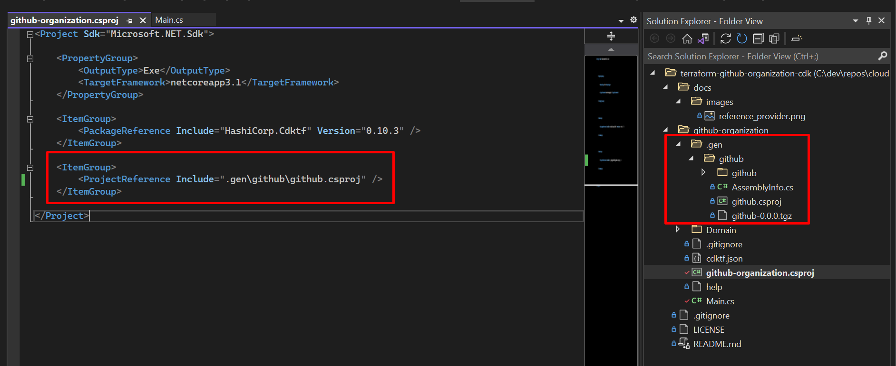

- [terraform-github-organization-cdk](#terraform-github-organization-cdk)
  - [Getting Started](#getting-started)
  - [Github Provider](#github-provider)
  - [Resources](#resources)

# terraform-github-organization-cdk

CDK version of github organization management in C#

## Getting Started

Need NodeJS

Install terraform
`choco install terraform`
`brew install terraform`

Install cdktf-cli
`npm install -g cdktf-cli`

Depending on the provider you are working with. You might need the CLI for that provider installed.

Login to TF Cloud
`cdktf login`

Initialize a project
`cdktf init --template=csharp`

Add provider version

```json
{
  "language": "csharp",
  "app": "dotnet run -p github-organization.csproj",
  "projectId": "9a17bdee-303b-4a00-81e5-71a28652ad58",
  "terraformProviders": ["github@~>4.24.1"],
  "terraformModules": [],
  "context": {
    "excludeStackIdFromLogicalIds": "true",
    "allowSepCharsInLogicalIds": "true"
  }
}
```

Once updated, run `cdktf get` to pull in provider libraries.

After the provider files have been downloaded, add a reference in your csproj file.



## Github Provider

Set environment variable `GITHUB_TOKEN` in your terminal.

```csharp
using System;
using Constructs;
using HashiCorp.Cdktf;
using github;


namespace MyCompany.MyApp
{
    class MyApp : TerraformStack
    {
        public MyApp(Construct scope, string id, string[] args) : base(scope, id)
        {
            // define resources here
            new GithubProvider(this, "github", new GithubProviderConfig
            {
                Organization = "cloud-tinkerers"
            })
        }
  ...
}
```

## Resources

- [Exploring CDK for Terraform for .NET](https://scottie.is/writing/cdktf-alpha-csharp-infrastructure/)
- [GitHub Provider - Terraform Docs](https://registry.terraform.io/providers/integrations/github/latest/docs)
